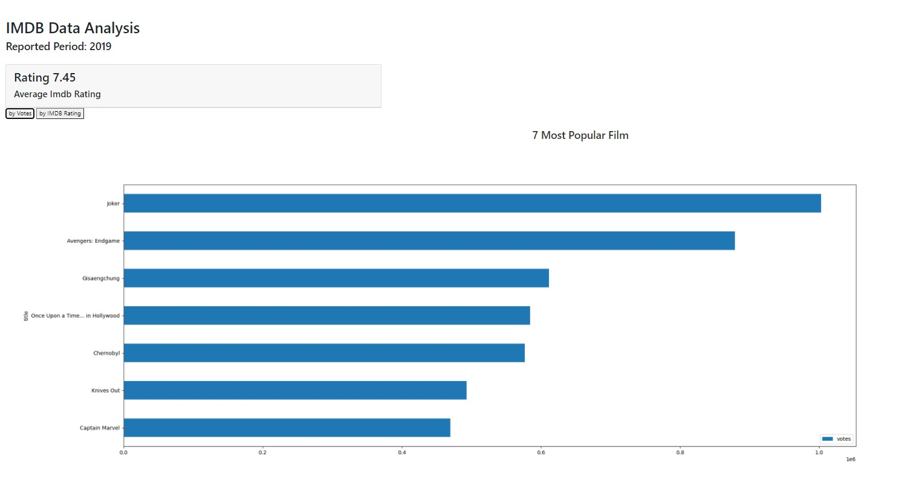
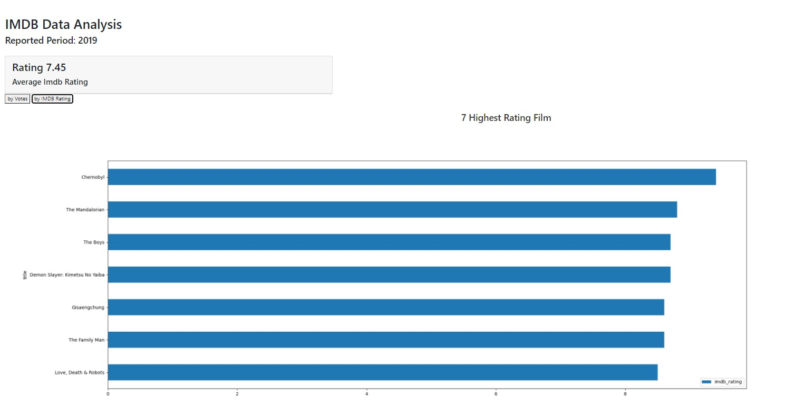

# Web-Scrapping using Beautifulsoup

Projek ini dikembangkan sebagai salah satu capstone project dari Algoritma Academy Data Analytics Specialization. Deliverables yang diharapkan dari projek ini adalah melakukan simple webscrapping untuk mendapatkan informasi. Pada project ini akan digunakan data film yang rilis di tahun 2019 dari [imdb.com](imdb.com/search/title/?release_date=2019-01-01,2019-12-31). Data yang diambil adalah `judul`, `imdb rating`, `metascore`, dan `votes` yang kemudian ditampilkan dalam bentuk dashboard sederhana dengan beberapa visualisasi data dalam bentuk chart.

## Dependencies

Beberapa package yang dibutuhkan dalam mengerjakan project ini:

- beautifulSoup4
- pandas
- flask
- matplotlib

Semua package tersebut tersimpan dalam file `requirements.txt` yang dapat diinstal dengan menjalankan perintah berikut pada console.

```python
pip install -r requirements.txt
```

## Running Web App

```python
python app.py
```

## Visualization



